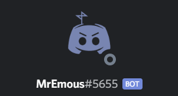

# MrEmous2

I made this bot for me and my friends on our discordserver. 
It has very basic functionalaty, 
but I'm quite proud of it. 

## Featues

- Simple currency system
- memes and nsfw from reddit
- fun commands

## Commands

- beep / ping: checks if bot is online
- help: shows help menu
- clear: remove all messages from and to MrEmous
- masterclear: delete messages in bulk
- memes: get memes from reddit
- say / spoiler: make MrEmous say stuff
- study: make him look up info for school; never finisched it
- test: command used for prototyping
- penislenght: calculates how big your penis is
- howgay: calculates how gay you are
- howlauw: calculates how lauw (cool in dutch) you are
- boobs / penis / porn: nsfw content from reddit
- vip: use viptoken from shop
- rick / rickroll: rickroll someone (needs rickrolltoken from shop)
- avater: get your discord avatar
- shop: see the shop
- balance / bal: check your balance
- inventory / inv: check someones inventory
- pay / transfer: pay someone
- rob / steal: rob someone
- buy: buy stuff from the store
- rich / leaderboard: see the most rich people

## Config

There are a few options you can configure in the config.json file. 
These are:

- prefix
- token
- token for reddit
- whether or not nsfw should be allowd by default
- the emoji used for coins (currency system)
- the adminrole

 
It's basicly a Dankmemer clone.

